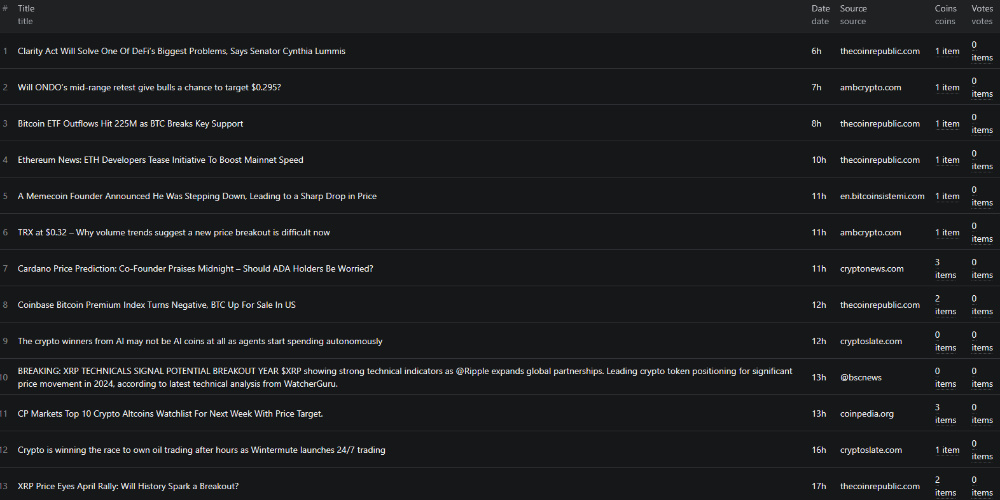

# How to Scrape CryptoPanic News in Node.js

This example shows how to scrape CryptoPanic news using a pre-built [Apify actor](https://apify.com/piotrv1001/cryptopanic-news-scraper) — no scraper setup required. Just call the actor via the Apify API and get structured crypto news data back in seconds.



## What this example does

- Calls the `piotrv1001/cryptopanic-news-scraper` Apify actor
- Passes an input configuration to the actor
- Waits for the run to complete
- Fetches results from the actor's dataset
- Prints each news item to the console

## Prerequisites

- [Node.js](https://nodejs.org/) v18 or higher
- An [Apify account](https://console.apify.com/sign-up) (free tier works)
- An [Apify API token](https://console.apify.com/settings/integrations)

## Installation

```bash
npm install
```

## Environment setup

Copy `.env.example` to `.env` and add your Apify API token:

```bash
cp .env.example .env
```

Then open `.env` and replace `your_apify_token_here` with your actual token from the [Apify console](https://console.apify.com/settings/integrations).

## Usage

```bash
npm start
```

## Code example

```js
import { ApifyClient } from 'apify-client';
import 'dotenv/config';

// Initialize the ApifyClient with your Apify API token
// Set APIFY_TOKEN in your .env file (copy .env.example to get started)
const client = new ApifyClient({
    token: process.env.APIFY_TOKEN,
});

// Prepare Actor input
const input = {};

// Run the Actor and wait for it to finish
const run = await client.actor("piotrv1001/cryptopanic-news-scraper").call(input);

// Fetch and print Actor results from the run's dataset (if any)
console.log('Results from dataset');
console.log(`💾 Check your data here: https://console.apify.com/storage/datasets/${run.defaultDatasetId}`);
const { items } = await client.dataset(run.defaultDatasetId).listItems();
items.forEach((item) => {
    console.dir(item);
});

// 📚 Want to learn more 📖? Go to → https://docs.apify.com/api/client/js/docs
```

## Example output

See [`sample-output.json`](./sample-output.json) for a full example. Each result item contains:

| Field | Description |
|-------|-------------|
| `title` | Headline of the news article |
| `date` | Relative publication date (e.g. `"4w"`, `"2d"`) |
| `coins` | Array of related coin ticker symbols (e.g. `["BTC", "ETH"]`) |
| `votes` | Array of vote counts by category (positive, negative, important, etc.) |
| `source` | Domain of the original article |

## Use cases

- **Crypto sentiment analysis** — aggregate vote data across news items to gauge market sentiment
- **Coin-specific news feeds** — filter results by coin ticker to build targeted feeds for BTC, ETH, or any altcoin
- **Trading signal pipelines** — feed scraped headlines and vote counts into NLP or ML models
- **Portfolio monitoring** — track news mentions for coins you hold and get alerts on high-vote articles
- **Research and journalism** — collect structured crypto news data at scale for analysis or reporting

## Try the actor on Apify

**[Open the CryptoPanic News Scraper on Apify](https://apify.com/piotrv1001/cryptopanic-news-scraper)**

## Related resources

- [How to Scrape CryptoPanic News — Full Tutorial](https://www.falconscrape.com/blog/how-to-scrape-cryptopanic-news)
- [Apify JavaScript Client Docs](https://docs.apify.com/api/client/js/docs)

## License

MIT
